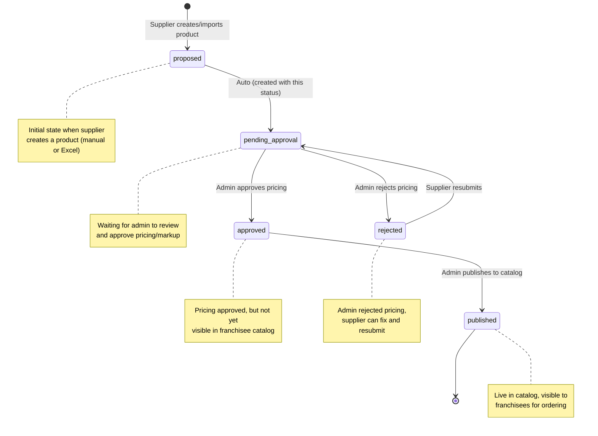

# Product States and Workflow - Complete Diagram

## Product Lifecycle States



---

## Complete Workflow Diagram

```
┌─────────────────────────────────────────────────────────────────────────┐
│                         SUPPLIER ACTIONS                                │
└─────────────────────────────────────────────────────────────────────────┘

    ┌─────────────┐         ┌──────────────────┐
    │   Manual    │         │  Excel Import    │
    │   Create    │         │  (Bulk Upload)   │
    └──────┬──────┘         └────────┬─────────┘
           │                         │
           │  POST /seller/          │  POST /vendor/custom/
           │  catalog-products       │  products/import
           │                         │
           └────────┬────────────────┘
                    │
                    ▼
           ┌────────────────┐
           │   PRODUCT      │
           │   CREATED      │
           │                │
           │ status:        │
           │ "proposed"     │
           │                │
           │ pricing_status:│
           │ "pending_      │
           │  approval"     │
           └────────┬───────┘
                    │
                    │ Automatic
                    │
                    ▼

┌─────────────────────────────────────────────────────────────────────────┐
│                      ADMIN REVIEW QUEUE                                 │
│                 /admin/pricing/approval-queue                           │
│                                                                         │
│    GET /admin/custom/products/pending                                  │
│    → Returns products with pricing_status="pending_approval"           │
└─────────────────────────────────────────────────────────────────────────┘

           ┌─────────────────┐
           │ Product appears │
           │ in Admin        │
           │ Approval Queue  │
           └────────┬────────┘
                    │
        ┌───────────┴────────────┐
        │                        │
        ▼                        ▼
┌───────────────┐        ┌───────────────┐
│    APPROVE    │        │    REJECT     │
└───────┬───────┘        └───────┬───────┘
        │                        │
        │ PATCH /admin/custom/   │ PATCH /admin/custom/
        │ products/:id/          │ products/:id/
        │ pricing-approval       │ pricing-approval
        │                        │
        │ Body: {                │ Body: {
        │   approved: true,      │   approved: false,
        │   markup: 25%          │   reason: "Price too high"
        │ }                      │ }
        │                        │
        ▼                        ▼
┌───────────────┐        ┌───────────────┐
│ pricing_status│        │ pricing_status│
│ = "approved"  │        │ = "rejected"  │
│               │        │               │
│ status:       │        │ status:       │
│ "approved"    │        │ "rejected"    │
│               │        │               │
│ approved_at   │        │ rejected_at   │
│ approved_by   │        │ rejected_by   │
│ markup_%      │        │ rejection_    │
│               │        │ reason        │
└───────┬───────┘        └───────┬───────┘
        │                        │
        │                        │
        │                        ▼
        │                ┌───────────────┐
        │                │  Supplier     │
        │                │  sees reason, │
        │                │  can RESUBMIT │
        │                └───────┬───────┘
        │                        │
        │                        │ PATCH /seller/
        │                        │ catalog-products/:id/
        │                        │ resubmit
        │                        │
        │                        ▼
        │                ┌───────────────┐
        │                │ Back to       │
        │                │ "pending_     │
        │                │  approval"    │
        │                └───────┬───────┘
        │                        │
        │ ┌──────────────────────┘
        │ │
        ▼ ▼
┌──────────────────────────────────────────────────────────────┐
│              ADMIN CATALOG MANAGEMENT                        │
│                  /admin/products                             │
│                                                              │
│  Admin manually publishes approved products to catalog       │
└──────────────────────────────────────────────────────────────┘
        │
        │ Manual action
        │ (product status update)
        │
        ▼
┌───────────────┐
│ status:       │
│ "published"   │
│               │
│ NOW visible   │
│ in franchisee │
│ catalog       │
└───────┬───────┘
        │
        ▼
┌──────────────────────────────────────────────────────────────┐
│           FRANCHISEE CATALOG & ORDERING                      │
│              /marketplace or /franchisee                     │
│                                                              │
│  GET /store/products                                        │
│  → Returns only products with status="published"            │
└──────────────────────────────────────────────────────────────┘
```

---

## API Endpoints by Role

### Supplier Endpoints

```javascript
// Create product manually
POST /seller/catalog-products
Body: { title, base_price, units_per_pack, ... }
→ Creates product with status="proposed", pricing_status="pending_approval"

// Bulk import via Excel
POST /vendor/custom/products/import
Body: FormData (Excel file)
→ Job queued, products created with same statuses

// View my products (all statuses)
GET /seller/catalog-products?limit=100
→ Returns all products (pending, approved, rejected)

// Resubmit rejected product
PATCH /seller/catalog-products/:id/resubmit
Body: { base_price, units_per_pack, ... }
→ Changes pricing_status back to "pending_approval"
```

### Admin Endpoints

```javascript
// View PENDING products queue (for approval)
GET /admin/custom/products/pending?seller_id=xxx&status=pending_approval
→ Returns products needing pricing approval
→ THIS IS WHERE YOU SEE SUPPLIER UPLOADS! ⭐

// Approve product pricing
PATCH /admin/custom/products/:id/pricing-approval
Body: { approved: true, markup_percentage: 25 }
→ Changes to status="approved", pricing_status="approved"

// Reject product pricing
PATCH /admin/custom/products/:id/pricing-approval
Body: { approved: false, rejection_reason: "..." }
→ Changes to status="rejected", pricing_status="rejected"

// View APPROVED products (catalog management)
GET /admin/custom/catalog-products?status=approved
→ Returns approved products ready to publish
→ THIS IS EMPTY NOW BECAUSE NO PRODUCTS ARE APPROVED YET! ⭐

// Publish product to franchisee catalog
PATCH /admin/products/:id/status
Body: { status: "published" }
→ Makes product visible to franchisees
```

### Franchisee Endpoints

```javascript
// View published catalog
GET /store/products?region_id=xxx
→ Returns only products with status="published"
```

---

## Key States Explained

| State | Pricing Status | Where Visible | Can Order? |
|-------|---------------|---------------|------------|
| **proposed** | pending_approval | Admin approval queue only | ❌ No |
| **approved** | approved | Admin catalog management | ❌ No (not published yet) |
| **rejected** | rejected | Supplier products (with reason) | ❌ No |
| **published** | approved | Franchisee catalog | ✅ Yes |

---

## Why `/admin/products` is Empty

```
Supplier uploads → status: "proposed"
                   pricing_status: "pending_approval"

Admin goes to:
❌ /admin/products → calls /admin/custom/catalog-products
   Filters for: status IN ("approved", "published")
   Result: EMPTY (no products approved yet)

Admin SHOULD go to:
✅ /admin/pricing/approval-queue → calls /admin/custom/products/pending
   Filters for: pricing_status = "pending_approval"
   Result: Shows all supplier uploads!
```

---

## Solution

**Admin should use this page to see supplier uploads:**

```
http://localhost:3000/admin/pricing/approval-queue
```

This page calls:
```
GET /api/admin/custom/products/pending
```

Which returns products with `pricing_status="pending_approval"`

---

## Complete Product Journey Example

1. **Supplier uploads Excel:**
   ```
   Products created:
   - status: "proposed"
   - pricing_status: "pending_approval"
   ```

2. **Admin reviews in approval queue:**
   ```
   Visit: /admin/pricing/approval-queue
   See: All pending products
   ```

3. **Admin approves:**
   ```
   PATCH /admin/custom/products/:id/pricing-approval
   
   Product updated:
   - status: "approved"
   - pricing_status: "approved"
   - markup_percentage: 25
   - approved_at: timestamp
   ```

4. **Product now appears in catalog management:**
   ```
   Visit: /admin/products
   See: Approved products (ready to publish)
   ```

5. **Admin publishes to catalog:**
   ```
   Update status to "published"
   
   Product updated:
   - status: "published"
   ```

6. **Franchisee can now order:**
   ```
   Visit: /marketplace
   See: Published products
   Add to cart: ✅
   ```

---

## Testing the Fix

1. **As Supplier:**
   - Upload Excel with products
   - Verify upload success

2. **As Admin:**
   - ❌ DON'T go to `/admin/products` (catalog)
   - ✅ GO to `/admin/pricing/approval-queue`
   - See pending products
   - Approve them

3. **Verify Flow:**
   - Approved products appear in `/admin/products`
   - Publish them
   - Check franchisee catalog shows them
