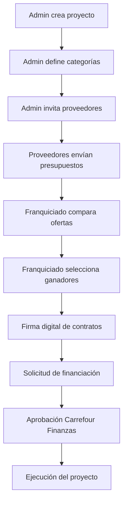

# Módulo de Nuevas Aperturas - Guía Rápida

## 🎯 Descripción

El **Módulo de Nuevas Aperturas** permite gestionar el proceso completo de apertura de nuevos establecimientos Carrefour desde la creación del proyecto hasta la ejecución, incluyendo:

- 📋 Creación y gestión de proyectos de apertura
- 🏷️ Categorización de necesidades (mobiliario, rotulación, IT, etc.)
- 📧 Invitación a proveedores especializados
- 💰 Sistema de presupuestos competitivos
- 📊 Comparación de ofertas multi-criterio
- ✍️ Firma digital de contratos
- 💳 Aprobación financiera
- 📝 Auditoría completa del proceso

## 🚀 Inicio Rápido

### 1. Configuración

Añade esta variable al archivo `.env.local`:

```bash
# Modo Mock (desarrollo sin backend)
NEXT_PUBLIC_MOCK_OPENINGS=true

# Modo Real (producción con Medusa)
# NEXT_PUBLIC_MOCK_OPENINGS=false
```

### 2. Uso en Componentes

```tsx
import { useOpenings } from '@/lib/store/openings';
import { openingsApi } from '@/lib/api/openings-client';

function MyComponent() {
  const { projects, setProjects, isLoadingProjects } = useOpenings();

  useEffect(() => {
    async function loadProjects() {
      const data = await openingsApi.getProjects();
      setProjects(data.projects);
    }
    loadProjects();
  }, []);

  return (
    <div>
      {projects.map(project => (
        <ProjectCard key={project.id} project={project} href={`/admin/openings/${project.id}`} />
      ))}
    </div>
  );
}
```

## 📂 Estructura de Archivos

```
src/
├── types/
│   └── openings.ts                 # Tipos TypeScript completos
├── lib/
│   ├── api/
│   │   ├── openings-client.ts      # API client (mock/real)
│   │   └── openings-mock.ts        # Datos de prueba
│   └── store/
│       └── openings.ts             # Zustand store
└── components/
    └── openings/
        └── shared/
            ├── ProjectStatusBadge.tsx
            ├── ProjectCard.tsx
            └── QuoteComparisonTable.tsx
```

## 🎭 Roles y Permisos

### Admin (Carrefour)
- ✅ Crear proyectos de apertura
- ✅ Definir categorías de necesidades
- ✅ Invitar proveedores
- ✅ Ver todos los presupuestos
- ✅ Gestionar todo el ciclo de vida

### Franquiciado
- ✅ Ver proyectos asignados
- ✅ Comparar presupuestos por categoría
- ✅ Seleccionar ofertas ganadoras
- ✅ Firmar contratos digitalmente
- ✅ Solicitar financiación

### Proveedor
- ✅ Ver invitaciones recibidas
- ✅ Descargar requisitos y planos
- ✅ Enviar presupuestos por categoría
- ✅ Actualizar ofertas (hasta fecha límite)
- ✅ Ver estado de adjudicación

## 🔄 Flujo de Trabajo



## 📊 Estados del Proyecto

| Estado | Descripción | Color |
|--------|-------------|-------|
| `draft` | Borrador inicial | Gris |
| `pending_categories` | Necesita definir categorías | Azul |
| `pending_suppliers` | Necesita invitar proveedores | Azul |
| `awaiting_quotes` | Esperando presupuestos | Amarillo |
| `quotes_received` | Presupuestos recibidos | Azul |
| `under_review` | Franquiciado revisando | Amarillo |
| `pending_signature` | Esperando firmas | Amarillo |
| `signed` | Firmado, pendiente financiación | Azul |
| `financing_requested` | Financiación solicitada | Amarillo |
| `approved` | Aprobado para ejecución | Verde |
| `in_progress` | En ejecución | Azul |
| `completed` | Completado | Verde |
| `cancelled` | Cancelado | Rojo |

## 🛠️ API Endpoints (Mock)

Todos los endpoints están implementados en modo mock con delay de 300ms:

### Proyectos
- `GET /api/admin/openings/projects` - Listar proyectos
- `GET /api/admin/openings/projects/:id` - Detalle de proyecto
- `POST /api/admin/openings/projects` - Crear proyecto
- `PUT /api/admin/openings/projects/:id` - Actualizar proyecto
- `POST /api/admin/openings/projects/:id/floor-plan` - Subir plano

### Categorías
- `GET /api/admin/openings/projects/:id/categories` - Listar categorías
- `POST /api/admin/openings/projects/:id/categories` - Crear categoría

### Invitaciones
- `POST /api/admin/openings/projects/:id/invite` - Invitar proveedores
- `GET /api/supplier/openings/invitations` - Mis invitaciones

### Presupuestos
- `GET /api/admin/openings/categories/:id/quotes` - Ver presupuestos
- `POST /api/supplier/openings/categories/:id/quote` - Enviar presupuesto
- `POST /api/franchisee/openings/quotes/:id/award` - Adjudicar
- `GET /api/franchisee/openings/categories/:id/compare` - Comparar

### Firmas
- `POST /api/franchisee/openings/quotes/:id/sign` - Firmar contrato

### Financiación
- `POST /api/franchisee/openings/projects/:id/financing` - Solicitar
- `POST /api/admin/openings/financing/:id/review` - Revisar solicitud

## 🧪 Modo Mock vs. Real

### Modo Mock (`NEXT_PUBLIC_MOCK_OPENINGS=true`)
- ✅ No requiere backend
- ✅ Datos de ejemplo pre-cargados
- ✅ Delay de 300ms simulado
- ✅ Perfecto para desarrollo UI

### Modo Real (`NEXT_PUBLIC_MOCK_OPENINGS=false`)
- ✅ Se conecta a Medusa.js backend
- ✅ Datos reales de base de datos
- ✅ Autenticación JWT
- ✅ Para producción

## 🔐 Seguridad

- 🔒 JWT tokens para autenticación
- 🔒 Row-level security en base de datos
- 🔒 Firmas digitales con SHA-256
- 🔒 Audit trail completo
- 🔒 Validación de permisos por rol

## 📈 Estado del Proyecto (Agosto 2026)

### ✅ Completado - Frontend 100% Funcional (Mock Mode)

1. ✅ Tipos TypeScript completos
2. ✅ API Client dual mode (mock/real)
3. ✅ Zustand Store
4. ✅ Componentes UI básicos
5. ✅ Estructura de rutas
6. ✅ Portal Admin completo
7. ✅ Portal Franquiciado completo
8. ✅ Portal Proveedor completo
9. ✅ **Sistema de documentos múltiples categorizados** (6 tipos)
10. ✅ **Workflow visual con timeline y control de estados** (14 estados)
11. ✅ **Historial de cambios de estado** con auditoría completa

### 🚧 Pendiente para Septiembre 2026

- [ ] Firma digital de contratos
- [ ] Sistema de financiación
- [ ] Dashboard y analytics
- [ ] Notificaciones en tiempo real
- [ ] **Backend completo** (ver BACKEND_GUIDE.md)

**Ver roadmap detallado:** [ROADMAP_SEPTIEMBRE.md](./ROADMAP_SEPTIEMBRE.md)

## 📚 Documentación Completa

### Guías Principales
- 🎯 **[ROADMAP_SEPTIEMBRE.md](./ROADMAP_SEPTIEMBRE.md)** - TODOs y plan de trabajo
- 📘 **[BACKEND_GUIDE.md](./BACKEND_GUIDE.md)** - Guía completa para backend (4200+ líneas)
- 📄 **[FRONTEND_DOCUMENTS_IMPLEMENTATION.md](./FRONTEND_DOCUMENTS_IMPLEMENTATION.md)** - Sistema de documentos múltiples
- 🧪 **[TESTING_GUIDE_OPENINGS.md](./TESTING_GUIDE_OPENINGS.md)** - Guía de testing

### Especificaciones Técnicas
- [SPECIFICATION_ES.md](./SPECIFICATION_ES.md) - Especificación en español
- [SPECIFICATION_EN.md](./SPECIFICATION_EN.md) - Especificación en inglés
- [EMAIL_PARA_BACKEND.md](./EMAIL_PARA_BACKEND.md) - Contexto para equipo backend

## 🤝 Contribución

Para añadir nuevas funcionalidades:

1. Actualizar tipos en `src/types/openings.ts`
2. Añadir mock data en `src/lib/api/openings-mock.ts`
3. Implementar en `src/lib/api/openings-client.ts` (mock + real)
4. Actualizar store si es necesario
5. Crear componentes UI
6. Añadir rutas
7. Actualizar ROADMAP_SEPTIEMBRE.md con progreso

## 🎉 Logros de Agosto 2026

- ✨ Sistema de **documentos técnicos múltiples** con 6 categorías
- ✨ **Workflow visual completo** con stepper, timeline y control manual
- ✨ **Historial de estados** con trazabilidad completa
- ✨ BACKEND_GUIDE.md expandido con 200+ líneas nuevas
- ✨ Frontend 100% funcional en modo mock

**Progreso total:** ~35% (Frontend completo, Backend pendiente)

---

**Versión:** 2.0.0  
**Última actualización:** 20 Agosto 2026  
**Próxima sesión:** Septiembre 2026
